# **DAFTAR TUGAS PERTEMUAN 7**

**Lab3**        [Klik disini](https://github.com/Ainulyqn/Lab3.git)  
**Labspy2**     [Klik disini](https://github.com/Ainulyqn/Labspy2.git)  
**Labspy3**     [Klik disini](https://github.com/Ainulyqn/Labspy3.git)  

# Labspy3

# PENJELASAN LOOPING

* Repository ini menjelaskan tentang **LOOPING** pada program python
* **LOOPING** sendiri artinya perulangan,dalam bahasa pemrograman merupakan suatu pernyataan untuk
menguntruksi komputer agar melakukan sesuatu secara berulang.
* Terdapat 2 jenis perulangan dalam bahasa pemrograman python ,yaitu perulangan **for** & **while**.
* Dan seperti inilah contoh dari program looping pada python.

# Alur Algoritma Latihan1.py  
**SOAL**  
* Tampilkan n bilangan acak yang lebih kecil dari 0.5

* Nilai n pada saat runtime

* Anda bisa menggunakan while atau for untuk menyelesaikannya

* Gunakan fungsi random () yang dapat di'import terlebih dahulu

* Kita mulai cara membuat program diatas

**FLOWCHART Latihan1.py**  
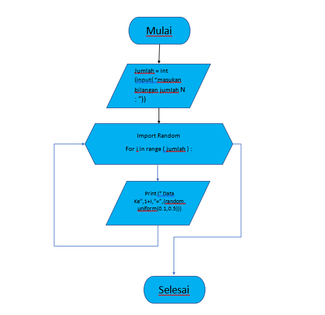

* Sebelum memulainya pastikan anda punya aplikasi **PYTHON**
jika belum punya silahkan [link ini](https://filehippo.com/download_python/)  
* Jika Sudah seperti biasa mendownload Apk lainnya hanya klik next - next - lalu finish  
* Buka aplikasi python tersebut  
* Lalu pilih menu file - New File atau juga bisa tekan **CTRL** + **N**  
* contoh nya seperti ini  
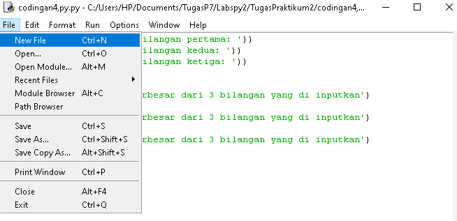  
* Jika sudah lakukan kodingan seperti gambar di bawah ini  
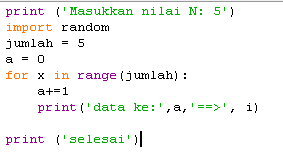  
* Jika sudah kalian bisa save program kalian dengan tekan **CTRL**+**S** atau mengklik menu file - save as dan beri nama pada program kalian, seperti contoh dibawah ini :
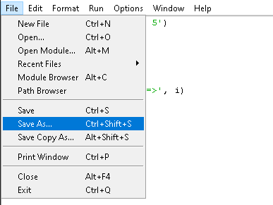  
* lalu menjalankan program kalian dengan menekan **f5** atau mengklik menu **RUN**  
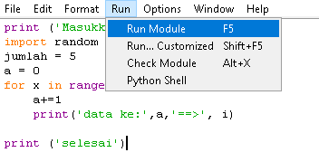  
* Jika gagal silahkan cek kembali apakah kodingan kalian sudah seperti gambar diatas
* Dan jika berhasil maka tampilan pada program python anda akan seperti dibawah ini  
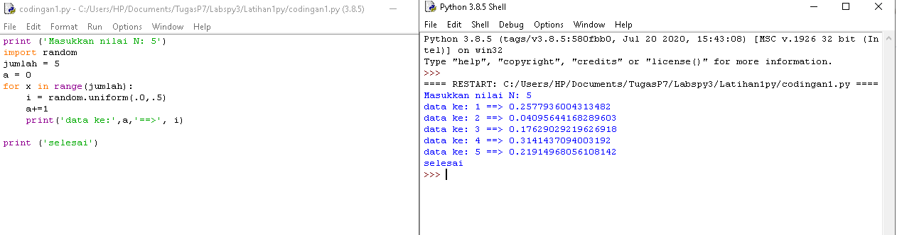  
* Berikut penjelasan dari program diiatas

`1. print ('Masukkan nilai N: 5')`  
`2. import random`  
`3. jumlah = 5`  
`4. a = 0`  
`5. for x in range(jumlah):`  
`6.     i = random.uniform(.0,.5)`  
`7.     a+=1`  
`8.     print('data ke:',a,'==>', i)`  
`10`  
`10. print ('selesai')`  

**PENJELASAN**  
* "print" : berfungsi untuk mencetak atau menampilkan objek ke perangkat keluaran (layar) atau ke file teks.

* "import" : fungsi lanjut yang dipanggil oleh statement import.

* "random" : untuk menentukan suatu pilihan.

* "range" : merupakan fungsi yang menghasilkan list. Fungsi ini akan menciptakan sebuah list baru dengan rentang nilai tertentu.

* "uniform": digunakan untuk menampilkan bilangan float random dengan batas awal bilangan x, dan batas akhir bilangan y.

# Alur Algoritma Latihan2.py

**SOAL**  
* Buat program untuk menampilkan bilangan terbesar dari n buah data yang di'inputkan

* Dan masukkan angka nol untuk berhenti

* Kita mulai cara membuat program diatas 

**FLOWCHART**  
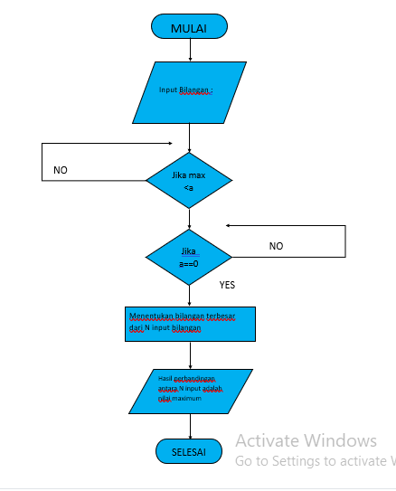  
* Sebelum memulainya pastikan anda punya aplikasi **PYTHON**  
* jika belum punya silahkan [link ini](https://filehippo.com/download_python/)  
* Jika Sudah seperti biasa mendownload Apk lainnya hanya klik next - next - lalu finish  
* Buka aplikasi python tersebut  
* Lalu pilih menu file - New File atau juga bisa tekan CTRL + N  
* contoh nya seperti ini  
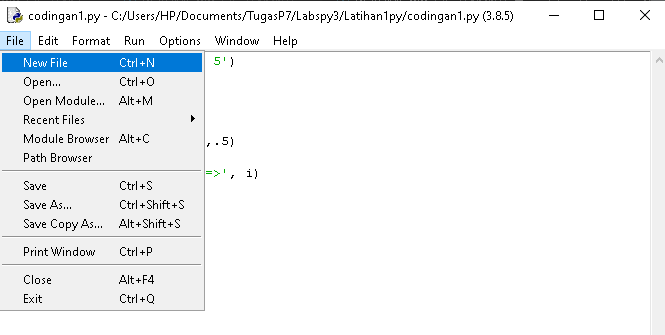  
* Jika sudah lakukan kodingan seperti gambar di bawah ini  
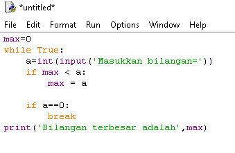  
* Jika sudah kalian bisa save program kalian dengan tekan **CTRL**+**S** atau mengklik menu file - save as dan beri nama pada program kalian  
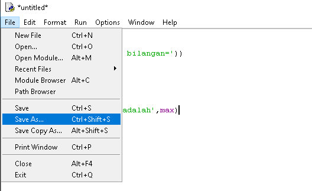  
* lalu menjalankan program kalian dengan menekan f5 atau mengklik menu **RUN**  
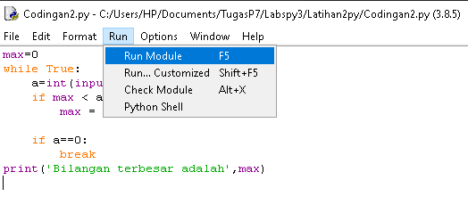  
* Jika gagal silahkan cek kembali apakah kodingan kalian sudah seperti gambar diatas  
* Dan jika berhasil maka tampilan pada program python anda akan seperti dibawah ini  
  
* Berikut penjelas Latihan2.py

`1. max=0`  
`2. while True:`  
`3.   a=int(input('Masukkan bilangan='))`  
`4.   if max < a:`  
`5.      max = a`  
`6.   if a==0:`  
`7.      break`  
`8. print('Bilangan terbesarnya adalah',max)` , 

* "max" : fungsi bulid-in untuk mencari nilai tertinggi. Fungsi ini dapat diberikan sebuah parameter berupa angka.

* "while" : disebut uncounted loop (perulangan yang tak terhitung), untuk perulangan yang memiliki syarat dan tidak tentu berapa banyak perulangannya.

* "int" : berfungsi mengkonversi bilangan maupun string angka menjadi bilangan bulat (integer).

* "if" = Bila suatu kondisi tertentu tercapai maka apa yang * harus dilakukan. Dengan fungsi ini kita bisa menjalankan suatu perintah dalam kondisi tertentu.

* "input" : masukan yang kita berikan ke program.

* "break" : fungsi yang menghentikan operasi dibawahnya jika suatu kondisi yang ditentukan telah tercapai.

* "print" : berfungsi untuk mencetak atau menampilkan objek ke perangkat keluaran (layar) atau ke file teks.

# Alur Algoritma Program1.py  

8 Buat program sederhana dengan perulangan,

* Seorang pengusaha menginvestasikan uangnya untuk memulai usahanya

* Dengan modal awal 100 juta

* Pada bulan pertama dan kedua belum mendapatkan laba

* Pada bulan ketiga baru mulai mendapatkan laba sebesar 1%

* Pada bulan kelima pendapatan meningkat 5%

* Selanjutnya pada bulan ke-8 mengalami penurunan keuntungan sebesar 2%

* Sehingga laba menjadi 3%

* Hitung total keuntungan selama 8 bulan berjalan usahanya

* Kita mulai cara membuat program diatas 

**FLOWCHART**
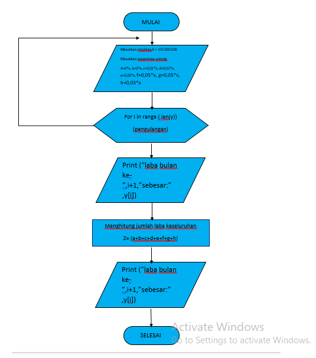  

* Sebelum memulainya pastikan anda punya aplikasi PYTHON  
* jika belum punya silahkan klik [link ini](https://filehippo.com/download_python/)  
* Jika Sudah seperti biasa mendownload Apk lainnya hanya klik next - next - lalu finish  
* Buka aplikasi python tersebut  
* Lalu pilih menu file - New File atau juga bisa tekan CTRL + N  
* contoh nya seperti ini  
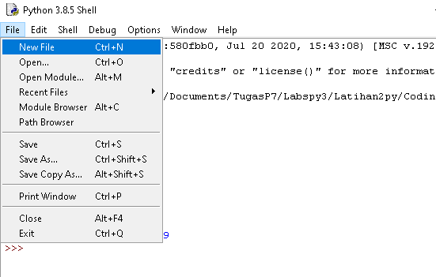  
* Jika sudah lakukan kodingan seperti gambar di bawah ini  
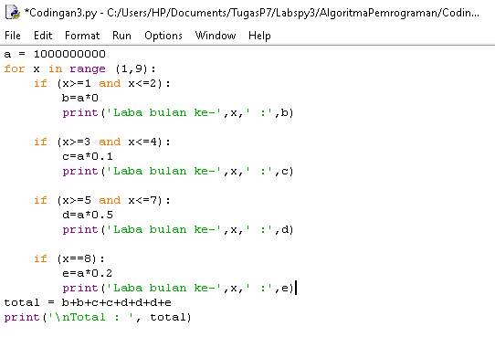  
* Jika sudah kalian bisa save program kalian dengan tekan **CTRL**+**S** atau mengklik menu file - save as dan beri nama pada program kalian  
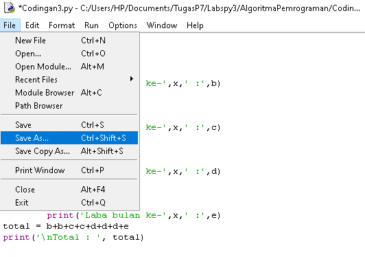  
* lalu menjalankan program kalian dengan menekan **f5** atau mengklik menu **RUN**  
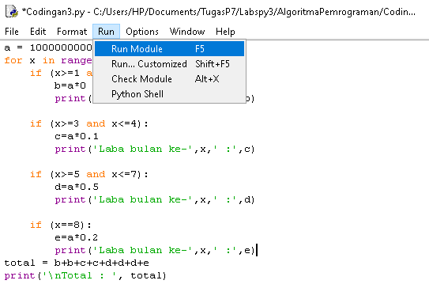  
* Jika gagal silahkan cek kembali apakah kodingan kalian sudah seperti gambar diatas 
Dan jika berhasil maka tampilan pada program python anda akan seperti dibawah ini
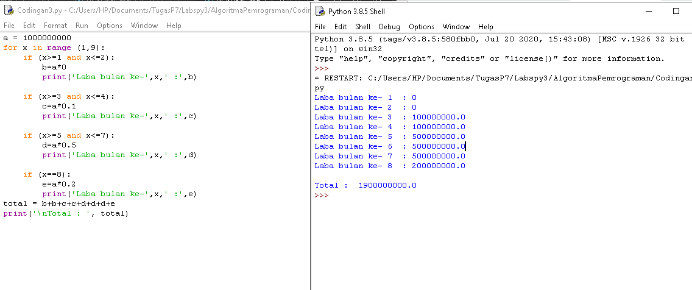  

# Berikut penjelasan dari Program1.py

`a = 1000000000`  
`for x in range (1,9):` =1 and x<=2):`  
`        b=a*0`  
`        print('Laba bulan ke-',x,' :',b)`

`    if (x>=3 and x<=4):`  
`        c=a*0.1`  
`        print('Laba bulan ke-',x,' :',c)`  

`    if (x>=5 and x<=7):`  
`        d=a*0.5`  
`        print('Laba bulan ke-',x,' :',d)`  

`    if (x==8):`  
`        e=a*0.2`  
`        print('Laba bulan ke-',x,' :',e)`  
`total = b+b+c+c+d+d+d+e` , 
`print('\nTotal : ', total)`

* masukkan nilai a

* gunakan for untuk perulangan dari 1 sampai 8.Perulangan for disebut counted loop (perulangan yang terhitung)

* lalu gunakan if pertama untuk menentukan laba bulan ke 1 dan ke 2.masukan variabel (b) kalikan nilai (a) dengan data bulan 1 dan 2. cetak (x) dan (b)

* lalu gunakan if kedua untuk menentukan laba bulan ke 3 dan ke 4.masukan variabel (b) kalikan nilai (a) dengan data bulan 3 dan 4. cetak (x) dan (c)

* lalu gunakan if ketiga untuk menentukan laba bulan ke 5 sampai ke 7.masukan variabel (b) kalikan nilai (a) dengan data bulan 5 sampai 7. cetak (x) dan (d)

* lalu gunakan if keempat untuk menentukan laba bulan ke 8.masukan variabel (b) kalikan nilai (a) dengan data bulan 8. cetak (x) dan (e)

* lalu total keseluruhan.

* cetak total